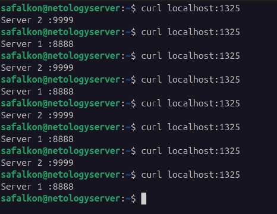
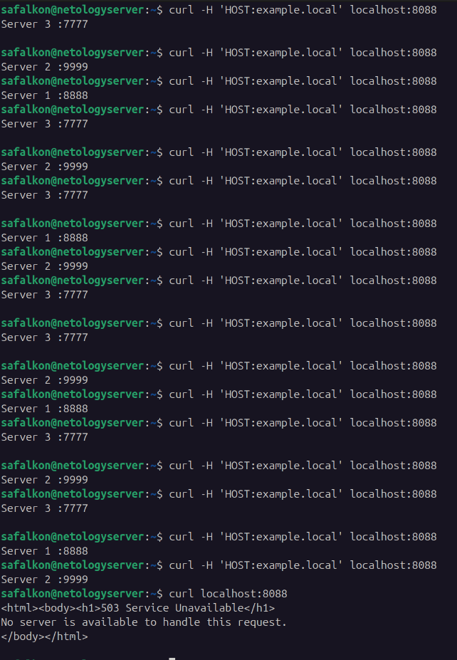
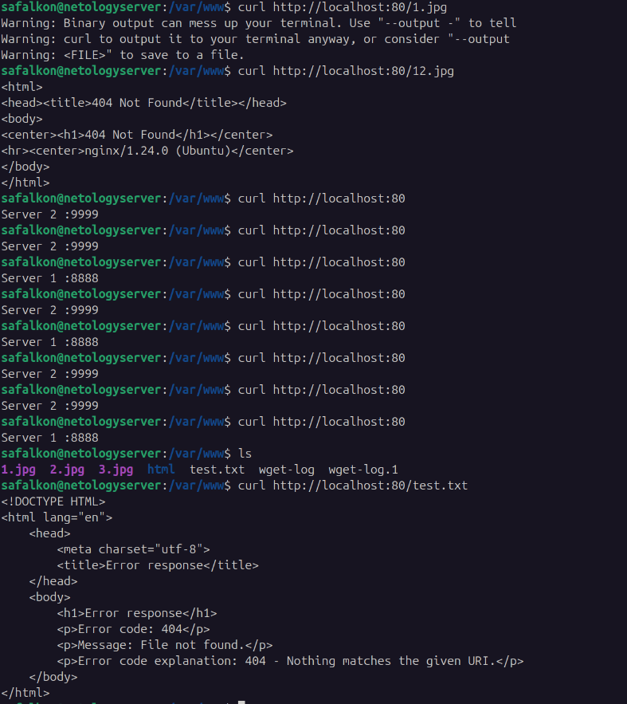
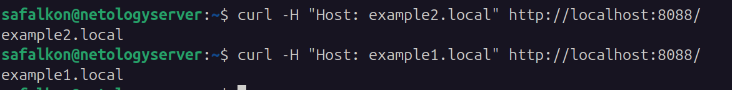

# Домашнее задание к занятию "`Кластеризация и балансировка нагрузки`" - `Сафронов Алексей`

---

### Задание 1

****

[haproxy](./HAproxy1.cfg)

---

### Задание 2

****

[haproxy](./HAproxy2.cfg)

---

### Задание 3

***

[nginx.conf](nginx/nginx.conf)
[example-http.conf](nginx/conf.d/example-http.conf)
[haproxy](haproxy/haproxy.cfg)

---

### Задание 4

***

[haproxy](./HAproxy3.cfg)

---
